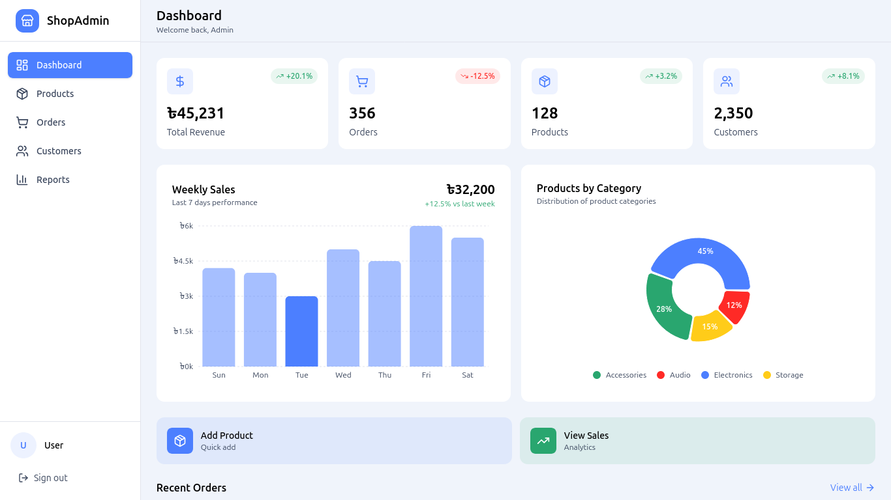
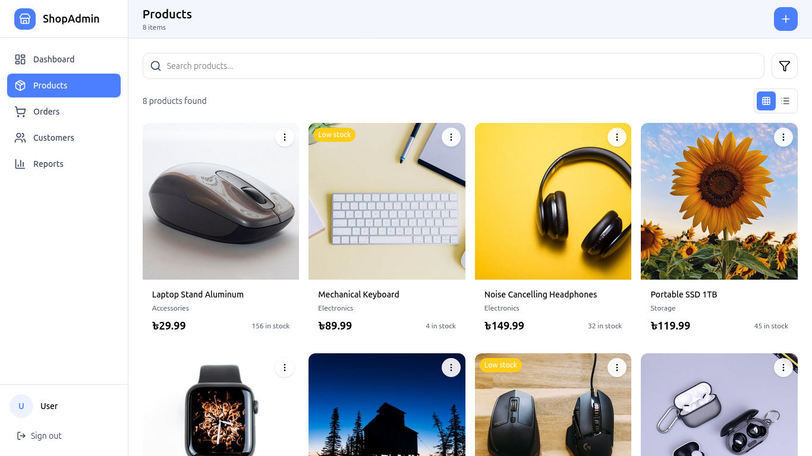
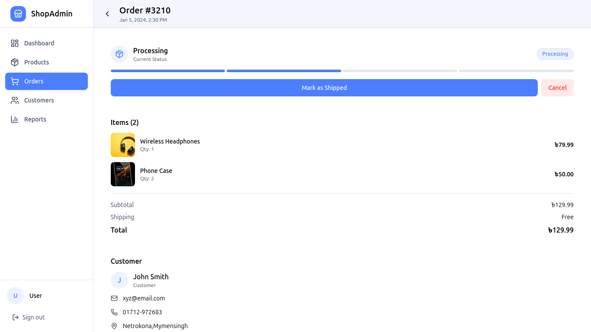
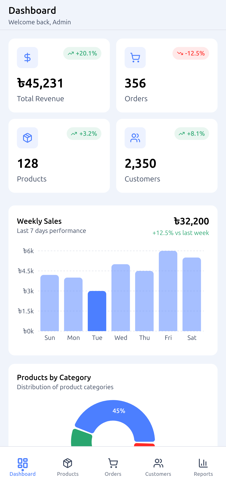

# Project Name : uShop | Dashboard eCommerce

---

## Project Overview

This project is built with **Next.js**, a React-based framework that enables server-side rendering, static generation, API routes, and modern frontend tooling.  
The structure is optimized for clean code, scalability, and deployment on platforms such as Vercel, Netlify, and cloud servers.

---

## Time
- **Duration**: 30 days
- **Dead Line**: 21 January 2026 - 20 February 2026
- **Completed**: under Development

---

## GitHub Badges


---

## Tech Stack
- **Framework**: Next.Js + Node.Js + Express.Js + MongoDB(mongoose)
- **Language**: JavaScript (ES6+)
- **Styling**: Tailwind CSS
- **Package Manager**: pnpm

---

## Features [FRONTENT]
**Dashboard**:

- Products page
- Product Details page
- Add New Product page
- Edit Product page

- Orders page
- Order Details page
- Add New Order page

- Customers page
- Customer Details page
- Add New Customer page
- Edit Customer page

- Weekly, Monthly, and Yearly Report Analytics page


## Features [BACKEND]

- Product management API endpoints (CRUD)
- Order management API endpoints (CRUD)

---

## Project Structure

- `CLIENT/` - Frontend React application (Dashboard & future Public site)
```text
CLIENT/
├── src/app/            Application Global routes
├── src/app/(admin)     Application Admin routes
├── src/components/     Reusable components
├── public/             Static assets
└── package.json
```

- `SERVER/` - Backend Node.js/Express API with MongoDB and Mongoose
```text
SERVER/
├── src/config          Server config
├── src/controllers     Endpoint controller
├── src/models          Mongoose Schema Model
├── src/routes          Endpoints Routes
├── src/index.js        Api endpoints
├── .env                Environment variables
└── package.json
```

---

## Deployed
this website is deployed to cpanel. also intigrated CI/CD model for automation and utilise time of deployment process in update and upgrade.

**Deployment flow:**

Developer
↓ (push to main)
GitHub Actions
↓ (install dependencies & build)
Static Build Artifacts
↓ (FTP upload)
cPanel Hosting
↓ (serve static files)
End User (Browser)


---

## Screenshots

| Name | Screenshot |
|------|------------|
| Dashboard (desktop) |  |
| ProductList (desktop) |  |
| Order Details (desktop) |  |
| Dashboard (mobile) |  |

---

## Installation

## Prerequisites
- **Node.js** >= 18
- **npm** >= 9

---

## Installations:

### [1]: Clone the app-ui-admin

```bash
git clone git@github.com:yasinarafatajad/app-ui-admin.git;
cd app-ui-admin
```

### [2] Install pnpm

```bash
npm install -g pnpm
```

### [3]: Install Dependencies

Using pnpm:
```bash
pnpm install
```
### [4]: Development
Start the development with hot module replacement:
```bash
pnpm dev
```

### [5]: Build for Production
Start the production :
```bash
pnpm build
```

---

## Environment Variables
Rename the .env.example into .env.local and replace the placeholder with your own key.

---

## Author
**Yasin Arafat Azad**  
Full-Stack Web Developer (MERN)

---

## License
This project is licensed under the **MIT License**.  
See the `LICENSE` file for details.

---